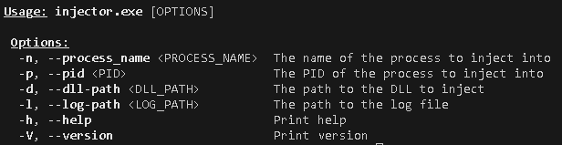
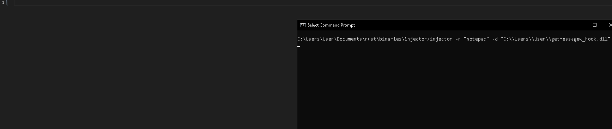
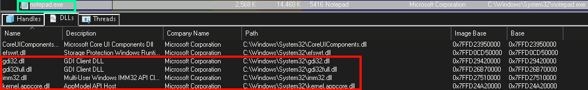

# INJECTOR

This is a tool written in Rust for injecting DLLs into running Windows processes. It utilizes a classic DLL injection technique and includes robust error handling and detailed logging of its operation. 

### Overview

With a DLL in hand and a target process selected, you can use this tool to inject the DLL into the process. The technique used follows this general structure:

1. Allocate memory into the target process's address space using `VirtualAllocEx`.

2. Write the DLL path into the process's address space with `WriteProcessMemory`.

3. Create a remote thread in the target process using `CreateRemoteThread` and within this thread, run `LoadLibraryA` to load your DLL.

### Usage

This tool allows you to specify either the target process name or the target process ID as well as the path to the DLL and the path to the log file. 
 

**Examples**

```shell
injector.exe -n "notepad" -d "my_dll.dll"
injector.exe -p 2334 -d "this_dll.dll" -l "C:\\Users\\Public\\injector.log"
```


An example of the robust logging the injector gives



A clip of Process Explorer showing the moment the DLL gets injected



### Installation

Before you begin, ensure you have met the following requirements.

**Prerequisites**

* Rust programming language: [Download and isntall from the official site](https://www.rust-lang.org/tools/install).

* Cargo package manager: This comes pre-installed when you install Rust. 

**Build From Source**

1. Clone the repository

```shell
git clone https://github.com/Quin-Darcy/injector.git
```

2. Build the project

```shell
cd injector
cargo build --release
```

3. Add to PATH
   
   On Windows, you can add the full path to the executable in your system's PATH environment variable. Assuming you've cloned the repository into `C:\Projects\injector`
   
   1. Type `Win+r` to open the Run window.
   
   2. Enter `systempropertiesadvanced`.
   
   3. In the System Properties window, click on "Environment Variables ...".
   
   4. Under the "System variables" section, find the "Path" variable, and click on "Edit."
   
   5. Click "New" and add the new path: `C:\Projects\injector\target\release`
   
   6. Click "OK" to save.
   
   Now, open a new Command Prompt and you should be able to use `injector` as a command.
