1. **Introduction and Theoretical Foundations**
    API hooking is a technique which allows one to control the flow of a program as well as intercept or modify data which passes between the APIs that a process may be using.

2. **Environment and Setup**
    * OS: Windows 10
    * IDE: VSCode
    * Target: Simple C program
    * Debugger: xdbg
    * Other Tools: Process Explorer, Ghidra

3. **Process Inspection and Target Selection**
    Since this project was for educational purposes only, I am creating my own process instead of injecting and hooking into an already running one. The target EXE is the following C program:
    ```C
        #include <windows.h>

        int WINAPI WinMain(HINSTANCE hInstance, HINSTANCE hPrevInstance,
            LPSTR lpCmdLine, int nCmdShow)
        {
            MessageBoxA(NULL, "This is a simple dialog box.", "API Hooking Practice", MB_OK);
            return 0;
        }
    ```
    All this function does is creates a message box with a particular message. After compiling this program, the result is a file which I called `target.exe`. This is the EXE whose image we inject the DLL into. Since the programs creates a message box, we know that it uses the `MessageBoxA` function which is a function that `USER32.dll` exports. And this is the function we aim to hook in this example. As you can see, the `MessageBoxA` function takes several arguments, two of which are strings. Once this function has been hooked and our hook function is called, we should be able to capture these arguments and print them out before `MessageBoxA` actually gets called. If the strings we capture and print are the same as the ones we see above, we will know the hooking was successful. 

4. **DLL Creation for Injection**
    API hooking can be broken down into two steps: DLL injection and IAT modification. The DLL which gets injected is responsible for taking care of the IAT modification. This means the DLL we inject has a big role to play and must perform quite a few subtasks. The DLL we use in this example is written in Rust, uses the `winapi` crate with loads of `unsafe` code blocks. Just as our target EXE was written in `C`, the DLL could have been as well, but Rust is really fun so we went with that. Here is the basic structure of the DLL that gets injected:

    * Get image base address
    * Get Import Directory Address
    * Get address of INT and IAT of target module
    * Get address of target function in target module
    * Perform hook
    * Unhook

    We explain each of these parts in depth later on.

5. **Process Suspension and DLL Injection**
    It should be noted that in practice, DLL injection usually takes place with a process that is already running. In the case for malware, it would want to inject its DLL into a process like `svchost.exe` or `explorer.exe`. However, in this example we are creating our own process and injecting into it. The principles are the same either way. 

    Starting the process is easy as all you need is the path to the EXE you want to run. With this we can make a call to `CreateProcessW` as follows:

    ```Rust
       // This function will create a process in a suspended state by using the CreateProcessW function
        // The CreateProcessW function creates a new process and its primary thread. The new process runs
        // in the security context of the calling process.
        fn create_process(target_process: &str) -> Result<PROCESS_INFORMATION, DWORD> {
            // We will take the given target process path and convert it to a wide string
            // This is because many of the Windows API functions require wide strings
            let target_process_w = to_wstring(target_process);

            // Next, we will define a STARTUPINFO struct which will be used to store information
            // about the process we are about to create. It specifies the window station, desktop,
            // standard handles, and appearance of the main window for a process at creation time.
            // The std::mem::zeroed() function is used to initialize the struct to all zeros.
            let mut si: STARTUPINFOW = unsafe { std::mem::zeroed() };

            // Now, we will define a PROCESS_INFORMATION struct which will also be used to store
            // information about the process we are about to create. It contains the process's
            // handle, thread handle, and identification information.
            let mut pi: PROCESS_INFORMATION = unsafe { std::mem::zeroed() };

            println!("Creating process...");

            // Create the target process in a suspended state
            let success = unsafe {
                CreateProcessW(
                    null_mut(),
                    target_process_w.as_ptr() as *mut u16,
                    null_mut(),
                    null_mut(),
                    0,
                    CREATE_SUSPENDED,
                    null_mut(),
                    null_mut(),
                    &mut si,
                    &mut pi,
                )
            };

            if success == 0 {
                Err(unsafe { winapi::um::errhandlingapi::GetLastError() })
            } else {
                println!("    Process successfully created in suspended state!");
                println!("        Process ID: {}", pi.dwProcessId);
                println!("        Thread ID: {}\n", pi.dwThreadId);
                Ok(pi)
            }
        } 
    ``` 

    To demonstrate the result of this snippet, below is the process list before and after this call to `CreateProcessW`

    
    

    Moreover, we can show the state of the process's main thread which should be suspended given the flag we passed to `CreateProcessW`:

    

    With the target process in a suspended state, we can now pump up its address space and give it some more memory than it currently has. This will be necessary as we need to get our big ol' DLL inside there! To do this, we make we need two things: How many bytes are we allocating to the process memory, a handle to the process we are allocating to. The first value is actually a little counter-intuitive at first glance. This is because one would think we need to allocate the number of bytes equal to the size of the DLL itself, but we actually only need to allocate the number of bytes equal to the size of the path to the DLL. Why this is will become clear shortly. The second thing we need is a handle to the process we are allocating to, but this is already done because this is one of the members of the `PROCESS_INFORMATION` struct we have a pointer to in `pi`. 

    With both these components in hand, we now make a call to `VirtualAllocEx`:

    ```Rust
        // Next, we will use the VirtualAllocEx function to allocate memory within the process
        // We will need the process handle to do this, which is stored in the PROCESS_INFORMATION struct
        // We will need the amount of memory to allocate, which is the size (in bytes) of the DLL path
        // We will need to specify the type of memory to allocate, which is read, write, and execute
        // We will need to specify the type of memory protection to use, which is read, write, and execute
        // The return value is the base address of the allocated region of pages
        fn allocate_memory(pi: PROCESS_INFORMATION, dll_path: &str) -> Result<*mut c_void, DWORD> {
            println!("Allocating memory in target process...");
            let dll_path_c = CString::new(dll_path).unwrap();
            let dll_path_ptr = unsafe {
                VirtualAllocEx(
                    pi.hProcess,
                    null_mut(),
                    dll_path_c.as_bytes_with_nul().len(),  // Allocate enough space for the DLL path
                    winapi::um::winnt::MEM_COMMIT | winapi::um::winnt::MEM_RESERVE,
                    winapi::um::winnt::PAGE_READWRITE,
                )
            };

            if dll_path_ptr.is_null() {
                Err(unsafe { winapi::um::errhandlingapi::GetLastError() })
            } else {
                println!("    Memory successfully allocated in target process!");
                println!("        Memory allocated at address: {:p}", dll_path_ptr);
                println!("        Memory allocated: {} bytes\n", dll_path_c.as_bytes_with_nul().len());
                Ok(dll_path_ptr)
            }
        }
    ```

    To view are shiny new region of memory, we can use a debugger at this point which is attached to the target process and jump to the base address of the allocated region! Here we see the address we need to jump to

    

    And look at all that space!

    

    Now that we have all this memory, let's write to it. What we will write is the file path to the DLL we want to inject. The reason we write the path and not the DLL itself is because shortly we will be placing a call to a Windows function, `LoadLibraryA` which only needs the path to the module that it loads and it takes care of the rest. There are other cases in which you would write the entire DLL, DLL injection for example, but not when you are using the Windows loader. 

    Writing to this region is straight forward and accomplished with:

    ```Rust
        // This function will write the DLL path to the memory allocated in the target process
        // It will accept the process handle, the base address of the allocated memory, and the DLL path
        // It will return a boolean value indicating whether the DLL path was successfully written
        fn write_memory(process_handle: HANDLE, dll_path_ptr: *mut c_void, dll_path: &str) -> Result<bool, DWORD> {
            println!("Writing DLL path to allocated memory...");
            let dll_path_c = CString::new(dll_path).unwrap();
            let mut bytes_written: usize = 0;

            let success = unsafe {
                WriteProcessMemory(
                    process_handle,
                    dll_path_ptr,
                    dll_path_c.as_ptr() as *mut c_void,
                    dll_path_c.as_bytes_with_nul().len(),
                    &mut bytes_written,
                )
            };

            if success == 0 {
                Err(unsafe { winapi::um::errhandlingapi::GetLastError() })
            } else {
                println!("    DLL path successfully written to allocated memory!");
                println!("        Bytes written: {}\n", bytes_written);
                Ok(true)
            }
        }
    ```

    And we can check this was successful by looking back at the `0xc0000` address we saw earlier

    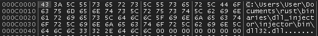

    There's our boy! Look at him all snuggled up in that address space ... awwwww!

6. **Remote Thread Creation and DLL Loading**

    Earlier we mentioned that we would be using the function `LoadLibraryA` to load our DLL into the target process. BUT! `LoadLibraryA` is a function within `kernel32.dll` and this module is loaded into every Windows process ... at some point. Recall that our target process was immediately put into a suspended state when it was created so there is a chance that `kernel32.dll` has not been loaded yet. If its not there, then we cannot reference `LoadLibraryA`. Let's check to see if it has been loaded:

    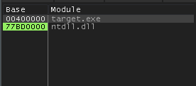

    Dang! Its not there. But do not fret, child, for we can simply wait until it is. What we can do is perform a loop where we unsuspend the target process for a very brief amount of time to give it a chance to load the module, suspend the process again, then check if its there. The following two functions accomplish this:

    ```Rust
        // This function will use the EnumProcessModulesEx function populate a vector with the
        // handles of all the modules loaded by the target process. It then iterates through
        // the vector and checks the name of each module against the name of the module we are
        // looking for. If the module is found, the function returns the handle of the module.
        // If the module is not found, the function returns an error code.
        fn check_if_kernel32_loaded(process_handle: HANDLE) -> Result<HMODULE, DWORD> {
            // cb_needed is the number of bytes required to store all the module handles
            let mut cb_needed: DWORD = 0;

            // This first call to EnumProcessModulesEx will set cb_needed to the correct value
            let result = unsafe {
                EnumProcessModulesEx(
                    process_handle,
                    std::ptr::null_mut(),
                    0,
                    &mut cb_needed,
                    LIST_MODULES_ALL,
                )
            };

            if result == 0 {
                return Err(unsafe { winapi::um::errhandlingapi::GetLastError() });
            }

            // Calculate the number of modules loaded by the target process by dividing
            // the number of bytes needed by the size of a module handle
            let module_count = cb_needed / std::mem::size_of::<HMODULE>() as DWORD;

            // Create a vector to store the module handles
            let mut h_mods: Vec<HMODULE> = vec![std::ptr::null_mut(); module_count as usize];

            // This second call to EnumProcessModulesEx will populate the vector with the module handles
            let result = unsafe {
                EnumProcessModulesEx(
                    process_handle,
                    h_mods.as_mut_ptr(),
                    cb_needed,
                    &mut cb_needed,
                    LIST_MODULES_ALL,
                )
            };

            if result == 0 {
                return Err(unsafe { winapi::um::errhandlingapi::GetLastError() });
            }

            // Create a buffer to store the name of each module
            let mut module_name = vec![0u8; 256];

            // Iterate through the vector of module handles and check the name of each module
            // If the name matches the name of the module we are looking for, return the handle
            for i in 0..module_count {
                let result = unsafe {
                    GetModuleBaseNameA(
                        process_handle,
                        h_mods[i as usize],
                        module_name.as_mut_ptr() as LPSTR,
                        256 as DWORD,
                    )
                };

                if result == 0 {
                    return Err(unsafe { winapi::um::errhandlingapi::GetLastError() });
                }

                let name = unsafe { CStr::from_ptr(module_name.as_ptr() as LPCSTR) }.to_string_lossy().into_owned();

                if name.eq_ignore_ascii_case("kernel32.dll") {
                    return Ok(h_mods[i as usize]);
                }
            }

            Err(unsafe { winapi::um::errhandlingapi::GetLastError() })
        }

        // This is the main loop for checking if kernel32.dll has been loaded by the target process
        fn suspend_and_check_kernel32(process_info: PROCESS_INFORMATION) -> Result<HMODULE, DWORD> {
            println!("Checking if kernel32.dll has been loaded...");

            // Check if kernel32.dll has been loaded by the target process
            // If it hasn't, then the function will return an error code
            let mut kernel32_base_addr = check_if_kernel32_loaded(process_info.hProcess);

            // If an error code is returned, then we need to unsuspend the target process to give
            // it a chance to load kernel32.dll. We then suspend the target process again and
            // check if kernel32.dll has been loaded. We repeat this process until kernel32.dll
            // has been loaded by the target process.
            while kernel32_base_addr.is_err() {
                // Unsuspend the target process
                let resume_result: DWORD = unsafe { ResumeThread(process_info.hThread) };

                if resume_result == DWORD::MAX {
                    return Err(unsafe { winapi::um::errhandlingapi::GetLastError() });
                }

                // Sleep for 1 millisecond to give the target process a chance to load kernel32.dll
                std::thread::sleep(std::time::Duration::from_millis(1));
                
                // Suspend the target process again
                let suspend_result: DWORD = unsafe { SuspendThread(process_info.hThread) };

                if suspend_result == DWORD::MAX {
                    return Err(unsafe { winapi::um::errhandlingapi::GetLastError() });
                }

                // Check if kernel32.dll has been loaded by the target process
                kernel32_base_addr = check_if_kernel32_loaded(process_info.hProcess);
            }

            println!("    kernel32.dll has been loaded into target process!");
            println!("        Base address: 0x{:x}\n", kernel32_base_addr.unwrap() as usize);
            kernel32_base_addr
        }
    ```

    After the above loop does its thing, the target process is put back into a suspended state and we can verify `kernel32.dll` is now loaded in our target process by checking those DLLs again:

    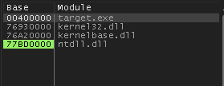

    Okay, sweet we have `kernel32.dll` and now we can call `LoadLibraryA`. NOT SO FAST FUCKFACE! *Where* exactly is `LoadLibraryA`?? If you don't know that, you can't reference it. Well let's take stock of what we have and see if we can determine where the function is: We have our calling (injector) process and our target process. The injector process, like all Windows processes has `kernel32.dll` already loaded (we never suspended it), so this means we can get the base address of this module. Moreover, with the help of a little function called `GetProcAddress`, we can get the Relative Virtual Address (RVA) of `LoadLibraryA` relative to this base address. 
    
    So then if we simply subtract the module's base address from the RVA, we will get the offset. The offset is the number of bytes which seperate the base address of the module from one of its functions. This is an unchanging value. So even though we are looking at the memory layout of `kernel32.dll` in a totally different process (injector), the local distances (offsets) will be the same across different address spaces. 
    
    So what! So, if we have the base address of `kernel32.dll` in our target process, we then add the offset to it and bingo bango, we have the address of `LoadLibraryA` in our target process. 

    The following function calculates the offset of `LoadLibraryA` from the calling process:

    ```Rust
        // This function will get the base address of the kernel32.dll module which has been 
        // loaded by the calling process (this program) and use the GetProcAddress function
        // to get the address (relative to the base address) of the LoadLibraryA function
        // The function then subtracts the base address from the LoadLibraryA address to get the offset
        fn get_loadlib_offset() -> Result<usize, DWORD> {
            println!("Getting offset of LoadLibraryA function...");
            let module_str = CString::new("kernel32.dll").unwrap();
            let loadlib_str = CString::new("LoadLibraryA").unwrap();
            let loadlib_offset: usize;

            unsafe {
                // First we need to get the kernel32.dll module handle
                let kernel32_handle = GetModuleHandleA(module_str.as_ptr());

                if kernel32_handle.is_null() {
                    println!("    Failed to get kernel32.dll module handle!");
                    return Err(winapi::um::errhandlingapi::GetLastError());
                }

                // Next we need to get the relative address of the LoadLibraryA function
                // We can do this by calling the GetProcAddress function
                let loadlib_ptr = GetProcAddress(kernel32_handle, loadlib_str.as_ptr());

                if loadlib_ptr.is_null() {
                    println!("    Failed to get address of LoadLibraryA function!");
                    return Err(winapi::um::errhandlingapi::GetLastError());
                }

                // Calculate the offset of LoadLibraryA in kernel32.dll
                loadlib_offset = loadlib_ptr as usize - kernel32_handle as usize;
            }

            println!("    Offset of LoadLibraryA function successfully retrieved!");
            println!("        Offset: 0x{:x}\n", loadlib_offset);
            Ok(loadlib_offset)
        }
    ```

    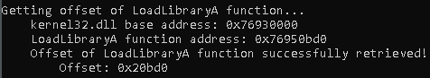

    And this function uses this offset to get the address of `LoadLibraryA` within the target process

    ```Rust
        // This function will calculate the address of the LoadLibraryA function in the target process
        // by adding the offset of the LoadLibraryA function in kernel32.dll to the base address of kernel32.dll
        fn get_loadlib_addr(kernel32_base_addr: HMODULE, offset: usize) -> Result<*const c_void, DWORD> {
            println!("Calculating address of LoadLibraryA function in target process...");
            let loadlib_addr_ptr = (kernel32_base_addr as usize + offset) as *const c_void;
            println!("    Address of LoadLibraryA function in target process successfully calculated!");
            println!("        Address: 0x{:x}\n", loadlib_addr_ptr as usize);
            Ok(loadlib_addr_ptr)
        } 
    ```

    Noice. We have the address of `LoadLibraryA` in the target process. We are approaching the finish line for the first part of API hooking, the DLL injection. 

    The next thing we need to do is actually *call* `LoadLibraryA` and pass it the pointer to our DLL path. Remember, this is just the address where we allocated the memory and wrote to it. How does one execute a function within a process whose thread is suspended? Just create a new thread ya' dip! 

    ```Rust
        // Now we will create a remote thread in the target process using CreateRemoteThread
        // This thread will be responsible for loading the DLL into the target process
        // using the LoadLibraryA function whose address we obtained above
        // The return value is the handle to the newly created thread
        fn create_remote_thread(process_info: PROCESS_INFORMATION, load_library: FARPROC, dll_path_ptr: LPVOID) -> Result<HANDLE, DWORD> {
            println!("Creating remote thread in target process...");
            let thread_id = unsafe {
                CreateRemoteThread(
                    process_info.hProcess,
                    null_mut(),
                    0,
                    Some(std::mem::transmute(load_library)), // <-- Transmute, wtf? this is to convert it to a "proper" function pointer
                    dll_path_ptr,  
                    0,
                    null_mut()
                )
            };
            if thread_id.is_null() {
                Err(unsafe { winapi::um::errhandlingapi::GetLastError() })
            } else {
                println!("    Remote thread created successfully!");
                println!("        Thread ID: {:?}\n", thread_id);
                Ok(thread_id)
            }
        }
    ```

    Here, we can see our new thread in action!

    Before

    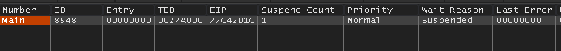

    After

    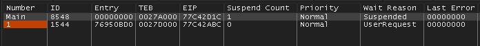 

    Once this thread does its thing and runs `LoadLibraryA` to load our DLL, we can then see our DLL in the listed of loaded modules

    Before

    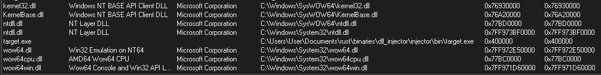

    After

    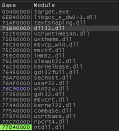

    And here you can see the start of the DLL

    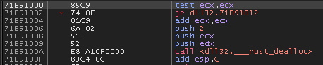

7. **Import Directory Address Location**

    There is something quite special about loading a DLL with `LoadLibraryA`. If your DLL has a `DllMain`, then it will automatically get called during the loading process. And that is where we find ourselves, presently. We have successfully loaded our DLL which means we now turn our attention away from the injector and onto the DLL itself. 

    `DllMain` need not be too complicated. In fact, it is used here as just the central caller for all the other steps. You will also notice the argument `fwd_reason`. This is a value that is passed into `DllMain` which is essentially *why* its being called. So its either being called because the receiving DLL is being attached to a new process, detached, or something else. What we are doing here is conditionally executing the call to `begin_hooking` if the reason we received is `PROCESS_ATTACH`. This makes it so the code only runs when the DLL first gets loaded. 

    ```Rust
        pub extern "system" fn DllMain(_hinst_dll: usize, fdw_reason: u32, _: usize) -> bool {
            if fdw_reason == winapi::um::winnt::DLL_PROCESS_ATTACH {
                let target_module_name: &str = "USER32.dll";
                let target_function_name: &str = "MessageBoxA";
                begin_hooking(target_module_name, target_function_name);
            }
            true
        }
    ```

    The key to any good API hook is a delicious vinegrette and the address of your target function. However, the target function address will not be the most straight forward thing to obtain. It will require us to navigate into several nested structures. The first of these being the Import Directory. The Import Directory is an array of `IMAGE_IMPORT_DESCRIPTOR` structures, each corresponding to a specific module that the PE file imports functions from. Each `IMAGE_IMPORT_DESCRIPTOR` structure thus forms a gateway to the functions that the PE file imports from one particular module.

    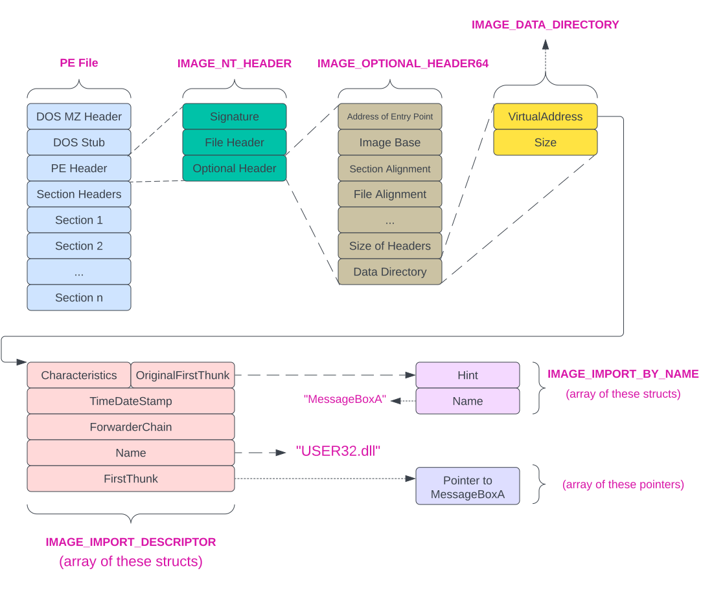

    As you can see, there are a few steps involved in getting to the Import Directory. However, the code is pretty straigt forward and is really just pointer chasing as you can see here:

    ```Rust
        // This function will return the address of the Import Directory of the EXE
        fn get_import_directory_addr(base_addr: usize) -> usize {
            unsafe {
                // The base address is set to a pointer to an IMAGE_DOS_HEADER structure 
                let dos_header = base_addr as *const IMAGE_DOS_HEADER;

                // The first 64 bytes of the PE file is the IMAGE_DOS_HEADER structure
                // which has a member called e_lfanew which is the offset to the PE header
                let pe_header = base_addr + (*dos_header).e_lfanew as usize;

                // The PE header is set as a pointer to an IMAGE_NT_HEADERS structure
                let nt_headers = pe_header as *const IMAGE_NT_HEADERS;

                // The Optional Header is a member of the IMAGE_NT_HEADERS structure
                let optional_header = &(*nt_headers).OptionalHeader;

                // The Import Directory is one of the data directories in the Optional Header
                let import_directory = &optional_header.DataDirectory[winapi::um::winnt::IMAGE_DIRECTORY_ENTRY_IMPORT as usize];

                // The address of the Import Directory is its relative virtual address (RVA) added to the base address
                let import_directory_addr = base_addr + import_directory.VirtualAddress as usize;

                import_directory_addr
            }
        }
    ```

    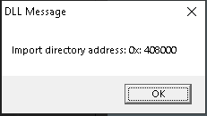

    With the address of the Import Directory in hand, we can now start to zero-in on the function we want to hook. To do this, we first need to find the module which contains our target function. This is something you will need to know before hand. In our example, we are trying to hook `MessageBoxA` and this is a function within `USER32.dll`. Thus, if the Import Directory is an array of IMAGE_IMPORT_DESCRIPTORs and each IMAGE_IMPORT_DESCRIPTOR corresponds to one of the modules which are target process imports functions from, then we need to find the specific `IMAGE_IMPORT_DESCRIPTOR` that corresponds with `USER32.dll`.

    Luckily for us, each `IMAGE_IMPORT_DESCRIPTOR` struct has a `Name` member which contains the name of the module it corresponds to. This means we just iterate throught the structs in the Import Directory and check each one's `Name` field against `"USER32.dll"`. 

    Once we find the `IMAGE_IMPORT_DESCRIPTOR` that corresponds to `USER32.dll`, we will be interested in two things: `OriginalFirstThunk` and `FirstThunk`. These are two members of the `IMAGE_IMPORT_DESCRIPTOR` struct. 

    * `OriginalFirstThunk`:  This is an array of `IMAGE_IMPORT_BY_NAME` structs, each of which contain the actual name of a function which the target process imports from the target module. So given that our target process imports `MessageBoxA` from `USER32.dll`, then there is an `IMAGE_IMPORT_DESCRIPTOR` that corresponds with `USER32.dll` and that struct contains an array of `IMAGE_IMPORT_BY_NAME` structs, one of which corresponds to `MessageBoxA`. This array if often call the Import Name Table (IAT).
    * `FirstThunk`: This goes hand in hand with `OriginalFirstThunk` in that it is an array of address, each of which points to a function whose name is in one of the `IMPORT_BY_NAME` structs. This array is called the Import Address Table (IAT). So if there is an `IMPORT_BY_NAME` struct for `MessageBoxA`, there is an address in `FirstThunk` that points to the actual function, `MessageBoxA`. 

    Now that we have this cleared up, let's first look at how we get the addresses of the INT and IAT of the target module, `USER32.dll`:

    ```Rust
        // This function iterates through the IMAGE_IMPORT_DESCRIPTOR structures by looking at the OriginalFirstThunk member
        // which is a pointer to an array of IMAGE_THUNK_DATA structures. This array is often called the Import Name Table (INT)
        // and is used to store the names of the imported functions. Once the target module is found, the FirstThunk member
        // is used to get the address of the IAT
        fn locate_iat_and_int(import_directory_addr: usize, exe_base_addr: usize, target_module: &str) -> Result<(usize, usize), ParseError> {
            let mut import_descriptor: *mut IMAGE_IMPORT_DESCRIPTOR = import_directory_addr as *mut IMAGE_IMPORT_DESCRIPTOR;
            // The Name member of the IMAGE_IMPORT_DESCRIPTOR structure stores an RVA to the name of the imported module
            // relative to the base address of the EXE. We can get the address of the module name by adding the RVA to the
            // base address
            unsafe {  
                while (*import_descriptor).FirstThunk != 0 {
                    let module_name_rva = (*import_descriptor).Name;
                    let module_name_va = (exe_base_addr as isize + module_name_rva as isize) as *const u8;
                    let module_name_ptr = module_name_va as *const u8;
                    let module_name_c = CStr::from_ptr(module_name_ptr as *const i8);

                    let module_name_str = match module_name_c.to_str() {
                        Ok(name) => name,
                        Err(e) => return Err(ParseError::GetModuleNameError(e)),
                    };
            
                    // If the module name matches the target module, we return the addresses of both the IAT and the INT
                    if module_name_str == target_module {
                        test_msgbox("Found target module: ", module_name_str);
                        let iat_addr = (exe_base_addr  + (*import_descriptor).FirstThunk as usize) as usize;
                        let int_addr = (exe_base_addr  + *(*import_descriptor).u.OriginalFirstThunk_mut() as usize) as usize;
                        return Ok((int_addr, iat_addr));
                    }
            
                    import_descriptor = import_descriptor.offset(1);
                }
            }

            Err(ParseError::ModuleNotFoundError)
        }
    ```

    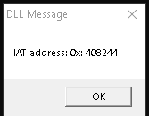

    Nice! We have the addresses of the IAT and the INT for `USER32.dll`. We must now iterate through the `IMAGE_IMPORT_BY_NAME` structs and find the one which corresponds to `MessageBoxA`. Since there is a one-to-one correspondance between the `IMAGE_IMPORT_BY_NAME` structs in the INT and the function pointer addresses in the IAT, we can iterate though both simulataneously. Checking the name in each `IMAGE_IMPORT_BY_NAME` struct until we find `MessageBoxA`, then we just return the function pointer we are on at that point in the iteration.

    ```Rust
        // Function to get the address of a specific function in the Import Address Table (IAT) 
        fn get_func_address_in_iat(int_addr: usize, iat_addr: usize, exe_base_addr: usize, target_function: &str) -> Result<usize, ParseError> {
            // Cast the addresses as mutable pointers to usize. These pointers are referring to the Import Name Table (INT) and Import Address Table (IAT).
            let mut int_ptr = int_addr as *mut usize;
            let mut iat_ptr = iat_addr as *mut usize;

            unsafe {
                // Iterate over the INT and IAT together
                while *int_ptr != 0 {
                    // Check if the entry is imported by name or ordinal. If the highest bit is set, the function is imported by ordinal.
                    if *int_ptr & 0x80000000 == 0 {
                        // When the entry is imported by name, the value at the INT pointer is a Relative Virtual Address (RVA). This RVA points to an 
                        // IMAGE_IMPORT_BY_NAME structure that contains the name of the function.
                        let import_by_name_rva = *int_ptr;

                        // Convert the RVA to a Virtual Address (VA) by adding it to the base address of the executable. Cast the result to a pointer to the
                        // IMAGE_IMPORT_BY_NAME structure.
                        let import_by_name_va = (exe_base_addr as isize + import_by_name_rva as isize) as *mut winapi::um::winnt::IMAGE_IMPORT_BY_NAME;

                        // The Name member of the IMAGE_IMPORT_BY_NAME structure is a pointer to a null-terminated string. This string is the name of the imported function.
                        let func_name_c = CStr::from_ptr((*import_by_name_va).Name.as_ptr());
                        let func_name_str = func_name_c.to_string_lossy();

                        test_msgbox("Function imported by name: ", &func_name_str);

                        // If the function name matches the target function, return the corresponding address from the IAT. This address is where the application
                        // will jump to when the imported function is called.
                        if func_name_str == target_function {
                            return Ok(*iat_ptr);
                        }
                    } else {
                        test_msgbox("Function imported by ordinal, skipping.", "");
                    }

                    // If this isn't the function we're looking for, increment the pointers to the next entries in the INT and IAT
                    int_ptr = int_ptr.offset(1);
                    iat_ptr = iat_ptr.offset(1);
                }
            }
        }
    ```

    Running this bad boy, we get

    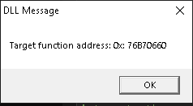

    And going to this address in our debugger we can see it is actually pointing to the `MessageBoxA` function

    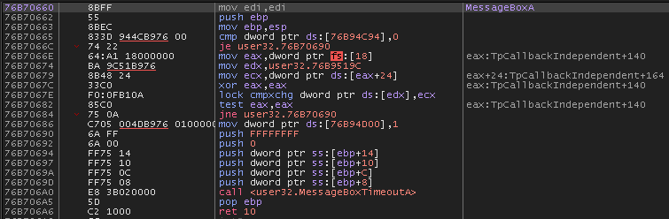