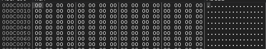

1. **Introduction and Theoretical Foundations**
    API hooking is a technique which allows one to control the flow of a program as well as intercept or modify data which passes between the APIs that a process may be using.

2. **Environment and Setup**
    * OS: Windows 10
    * IDE: VSCode
    * Target: Simple C program
    * Debugger: xdbg
    * Other Tools: Process Explorer, Ghidra

3. **Process Inspection and Target Selection**
    Since this project was for educational purposes only, I am creating my own process instead of injecting and hooking into an already running one. The target EXE is the following C program:
    ```C
        #include <windows.h>

        int WINAPI WinMain(HINSTANCE hInstance, HINSTANCE hPrevInstance,
            LPSTR lpCmdLine, int nCmdShow)
        {
            MessageBoxA(NULL, "This is a simple dialog box.", "API Hooking Practice", MB_OK);
            return 0;
        }
    ```
    All this function does is creates a message box with a particular message. After compiling this program, the result is a file which I called `target.exe`. This is the EXE whose image we inject the DLL into. Since the programs creates a message box, we know that it uses the `MessageBoxA` function which is a function that `USER32.dll` exports. And this is the function we aim to hook in this example. As you can see, the `MessageBoxA` function takes several arguments, two of which are strings. Once this function has been hooked and our hook function is called, we should be able to capture these arguments and print them out before `MessageBoxA` actually gets called. If the strings we capture and print are the same as the ones we see above, we will know the hooking was successful. 

4. **DLL Creation for Injection**
    API hooking can be broken down into two steps: DLL injection and IAT modification. The DLL which gets injected is responsible for taking care of the IAT modification. This means the DLL we inject has a big role to play and must perform quite a few subtasks. The DLL we use in this example is written in Rust, uses the `winapi` crate with loads of `unsafe` code blocks. Just as our target EXE was written in `C`, the DLL could have been as well, but Rust is really fun so we went with that. Here is the basic structure of the DLL that gets injected:

    * Get image base address
    * Get Import Directory Address
    * Get address of INT and IAT of target module
    * Get address of target function in target module
    * Perform hook
    * Unhook

    We explain each of these parts in depth later on.

5. **Process Suspension and DLL Injection**
    It should be noted that in practice, DLL injection usually takes place with a process that is already running. In the case for malware, it would want to inject its DLL into a process like `svchost.exe` or `explorer.exe`. However, in this example we are creating our own process and injecting into it. The principles are the same either way. 

    Starting the process is easy as all you need is the path to the EXE you want to run. With this we can make a call to `CreateProcessW` as follows:

    ```Rust
       // This function will create a process in a suspended state by using the CreateProcessW function
        // The CreateProcessW function creates a new process and its primary thread. The new process runs
        // in the security context of the calling process.
        fn create_process(target_process: &str) -> Result<PROCESS_INFORMATION, DWORD> {
            // We will take the given target process path and convert it to a wide string
            // This is because many of the Windows API functions require wide strings
            let target_process_w = to_wstring(target_process);

            // Next, we will define a STARTUPINFO struct which will be used to store information
            // about the process we are about to create. It specifies the window station, desktop,
            // standard handles, and appearance of the main window for a process at creation time.
            // The std::mem::zeroed() function is used to initialize the struct to all zeros.
            let mut si: STARTUPINFOW = unsafe { std::mem::zeroed() };

            // Now, we will define a PROCESS_INFORMATION struct which will also be used to store
            // information about the process we are about to create. It contains the process's
            // handle, thread handle, and identification information.
            let mut pi: PROCESS_INFORMATION = unsafe { std::mem::zeroed() };

            println!("Creating process...");

            // Create the target process in a suspended state
            let success = unsafe {
                CreateProcessW(
                    null_mut(),
                    target_process_w.as_ptr() as *mut u16,
                    null_mut(),
                    null_mut(),
                    0,
                    CREATE_SUSPENDED,
                    null_mut(),
                    null_mut(),
                    &mut si,
                    &mut pi,
                )
            };

            if success == 0 {
                Err(unsafe { winapi::um::errhandlingapi::GetLastError() })
            } else {
                println!("    Process successfully created in suspended state!");
                println!("        Process ID: {}", pi.dwProcessId);
                println!("        Thread ID: {}\n", pi.dwThreadId);
                Ok(pi)
            }
        } 
    ``` 

    To demonstrate the result of this snippet, below is the process list before and after this call to `CreateProcessW`

    
    

    Moreover, we can show the state of the process's main thread which should be suspended given the flag we passed to `CreateProcessW`:

    

    With the target process in a suspended state, we can now pump up its address space and give it some more memory than it currently has. This will be necessary as we need to get our big ol' DLL inside there! To do this, we make we need two things: How many bytes are we allocating to the process memory, a handle to the process we are allocating to. The first value is actually a little counter-intuitive at first glance. This is because one would think we need to allocate the number of bytes equal to the size of the DLL itself, but we actually only need to allocate the number of bytes equal to the size of the path to the DLL. Why this is will become clear shortly. The second thing we need is a handle to the process we are allocating to, but this is already done because this is one of the members of the `PROCESS_INFORMATION` struct we have a pointer to in `pi`. 

    With both these components in hand, we now make a call to `VirtualAllocEx`:

    ```Rust
        // Next, we will use the VirtualAllocEx function to allocate memory within the process
        // We will need the process handle to do this, which is stored in the PROCESS_INFORMATION struct
        // We will need the amount of memory to allocate, which is the size (in bytes) of the DLL path
        // We will need to specify the type of memory to allocate, which is read, write, and execute
        // We will need to specify the type of memory protection to use, which is read, write, and execute
        // The return value is the base address of the allocated region of pages
        fn allocate_memory(pi: PROCESS_INFORMATION, dll_path: &str) -> Result<*mut c_void, DWORD> {
            println!("Allocating memory in target process...");
            let dll_path_c = CString::new(dll_path).unwrap();
            let dll_path_ptr = unsafe {
                VirtualAllocEx(
                    pi.hProcess,
                    null_mut(),
                    dll_path_c.as_bytes_with_nul().len(),  // Allocate enough space for the DLL path
                    winapi::um::winnt::MEM_COMMIT | winapi::um::winnt::MEM_RESERVE,
                    winapi::um::winnt::PAGE_READWRITE,
                )
            };

            if dll_path_ptr.is_null() {
                Err(unsafe { winapi::um::errhandlingapi::GetLastError() })
            } else {
                println!("    Memory successfully allocated in target process!");
                println!("        Memory allocated at address: {:p}", dll_path_ptr);
                println!("        Memory allocated: {} bytes\n", dll_path_c.as_bytes_with_nul().len());
                Ok(dll_path_ptr)
            }
        }
    ```

    To view are shiny new region of memory, we can use a debugger at this point which is attached to the target process and jump to the base address of the allocated region! Here we see the address we need to jump to

    

    And look at all that space!

    